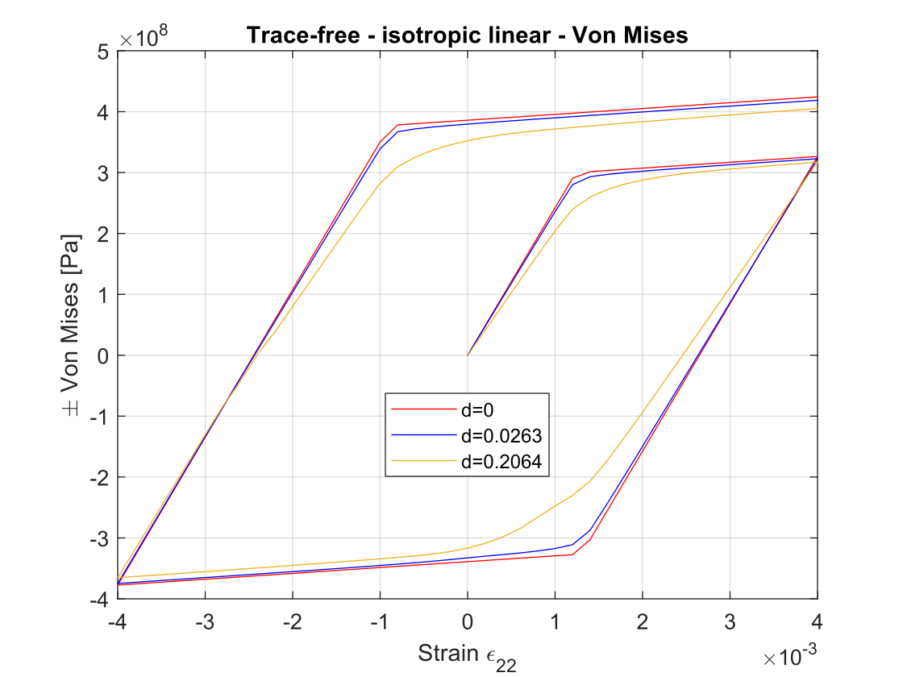

<h1 style="text-align: center"> MI Plasticity - RVE analysis report  </h1>

Yangyuanchen Liu

## 1. RVE settings

* Material parameters: $\lambda=E\nu/(1+\nu)(1-2\nu),\mu=E/2(1+\nu)$

  | Young's modulus $E$ | Poisson ratio $\nu$ | $\lambda$    | $\mu$       |
  | ------------------- | ------------------- | ------------ | ----------- |
  | 210 [GPa]           | 0.3                 | 121.15 [GPa] | 80.77 [GPa] |

* Configuration: RVE with square-shaped crack ($a=1$), $r_a\in[0,0.4,0.8]$, corresponding to $d\in[0,0.0263,0.2064].$

  

## 2. Trace-free test

### 2.1 Trace-free: (a) perfect plasticity

* BC's: $\overline{\varepsilon}=\varepsilon_{11}\mathbf{e}_1\otimes\mathbf{e}_1+\varepsilon_{22}\mathbf{e}_2\otimes\mathbf{e}_2+\varepsilon_{33}\mathbf{e}_3\otimes\mathbf{e}_3,$ where $\varepsilon_{22}=0\rightarrow0.004\rightarrow-0.004\rightarrow0.004,$
$\varepsilon_{11}=\varepsilon_{33}=-{1\over 2}\varepsilon_{22}.$

* Harding behavior
  
  $\sigma_Y=300$ MPa, $\varepsilon_Y=0.001429$

  

* Plots
  
  | Figure                                  | Dir                               |
  | --------------------------------------- | --------------------------------- |
  | $\pm\text{Von Mises} -\varepsilon_{22}$ | `./Plot/trace-free/pp/vm.svg`     |
  | $\sigma_{22}-\varepsilon_{22}$          | `./Plot/trace-free/pp/s22e22.svg` |
  | $\sigma_{11}-\varepsilon_{22}$          | `./Plot/trace-free/pp/s11e22.svg` |
  
  
  
  
  
  

### 2.2 Trace-free: (b)  isotropic hardening (linear)

* BC's: $\overline{\varepsilon}=\varepsilon_{11}\mathbf{e}_1\otimes\mathbf{e}_1+\varepsilon_{22}\mathbf{e}_2\otimes\mathbf{e}_2+\varepsilon_{33}\mathbf{e}_3\otimes\mathbf{e}_3,$ where $\varepsilon_{22}=0\rightarrow0.004\rightarrow-0.004\rightarrow0.004,$
  $\varepsilon_{11}=\varepsilon_{33}=-{1\over 2}\varepsilon_{22}.$

* Harding behavior

  $K(\alpha)=\sigma_Y+\overline{K}\alpha$

  where $\sigma_Y=300$ MPa, $\overline{K}=100$ GPa.

  

* Plots

  | Figure                                  | Dir                                            |
  | --------------------------------------- | ---------------------------------------------- |
  | $\pm\text{Von Mises} -\varepsilon_{22}$ | `./Plot/trace-free/iso_li/vm.svg`     |
  | $\sigma_{22}-\varepsilon_{22}$          | `./Plot/trace-free/iso_li/s22e22.svg` |
  | $\sigma_{11}-\varepsilon_{22}$          | `./Plot/trace-free/iso_li/s11e22.svg` |

  
  
  
  
  
  

### 2.3 Trace-free: (c)  isotropic hardening (exponential)

* BC's: $\overline{\varepsilon}=\varepsilon_{11}\mathbf{e}_1\otimes\mathbf{e}_1+\varepsilon_{22}\mathbf{e}_2\otimes\mathbf{e}_2+\varepsilon_{33}\mathbf{e}_3\otimes\mathbf{e}_3,$ where $\varepsilon_{22}=0\rightarrow0.004\rightarrow-0.004\rightarrow0.004,$
  $\varepsilon_{11}=\varepsilon_{33}=-{1\over 2}\varepsilon_{22}.$

* Harding behavior

  $K(\alpha)=\sigma_Y+\theta\overline{H}\alpha+(\overline{K}_{\infty}-\overline{K}_0)[1-\exp(-\delta\alpha)]$

  where $\sigma_Y=300$ MPa, $\overline{H}=0$, $\overline{K}_{\infty}-\overline{K}_0=100$ GPa, $\delta=1500$

  

* Plots

  | Figure                                  | Dir                                            |
  | --------------------------------------- | ---------------------------------------------- |
  | $\pm\text{Von Mises} -\varepsilon_{22}$ | `./Plot/trace-free/iso_ex/vm.svg`     |
  | $\sigma_{22}-\varepsilon_{22}$          | `./Plot/trace-free/iso_ex/s22e22.svg` |
  | $\sigma_{11}-\varepsilon_{22}$          | `./Plot/trace-free/iso_ex/s11e22.svg` |
  
  
  
  
  
  
  

### 2.4 Trace-free: (d) kinematic hardening

* BC's: $\overline{\varepsilon}=\varepsilon_{11}\mathbf{e}_1\otimes\mathbf{e}_1+\varepsilon_{22}\mathbf{e}_2\otimes\mathbf{e}_2+\varepsilon_{33}\mathbf{e}_3\otimes\mathbf{e}_3,$ where $\varepsilon_{22}=0\rightarrow0.004\rightarrow-0.004\rightarrow0.004,$
   $\varepsilon_{11}=\varepsilon_{33}=-{1\over 2}\varepsilon_{22}.$

* Harding behavior

  

  $K(\alpha)=\sigma_Y+\overline{K}\alpha$

  where $\sigma_Y=300$ MPa, $\overline{K}=100$ GPa.

* Plots

  | Figure                                  | Dir                                            |
  | --------------------------------------- | ---------------------------------------------- |
  | $\pm\text{Von Mises} -\varepsilon_{22}$ | `./Plot/trace-free/kin_li/vm.svg`     |
  | $\sigma_{22}-\varepsilon_{22}$          | `./Plot/trace-free/kin_li/s22e22.svg` |
  | $\sigma_{11}-\varepsilon_{22}$          | `./Plot/trace-free/kin_li/s11e22.svg` |

  
  
  
  
  
  

## 3. Multiple loading paths

### 3.1 Uniaxial tension

* BC's: $\overline{\varepsilon}=\varepsilon_{11}\mathbf{e}_1\otimes\mathbf{e}_1+\varepsilon_{22}\mathbf{e}_2\otimes\mathbf{e}_2+\varepsilon_{33}\mathbf{e}_3\otimes\mathbf{e}_3,$ where $\varepsilon_{22}=0\rightarrow0.004\rightarrow-0.004\rightarrow0.004,$
   $\varepsilon_{11}=\varepsilon_{33}=0.$
   
* Harding behavior

  $K(\alpha)=\sigma_Y+\overline{K}\alpha$

  where $\sigma_Y=300$ MPa, $\overline{K}=100$ GPa.

  

* Plots

  | Figure                                  | Dir                                  |
  | --------------------------------------- | ------------------------------------ |
  | $\pm\text{Von Mises} -\varepsilon_{22}$ | `./Plot/multi-load/tension/vm.svg`     |
  | $\sigma_{22}-\varepsilon_{22}$          | `./Plot/multi-load/tension/s22e22.svg` |
  | $\sigma_{11}-\varepsilon_{22}$          | `./Plot/multi-load/tension/s11e22.svg` |
  
  
  
  
  
  
  
  
  
  
  
  
  
  