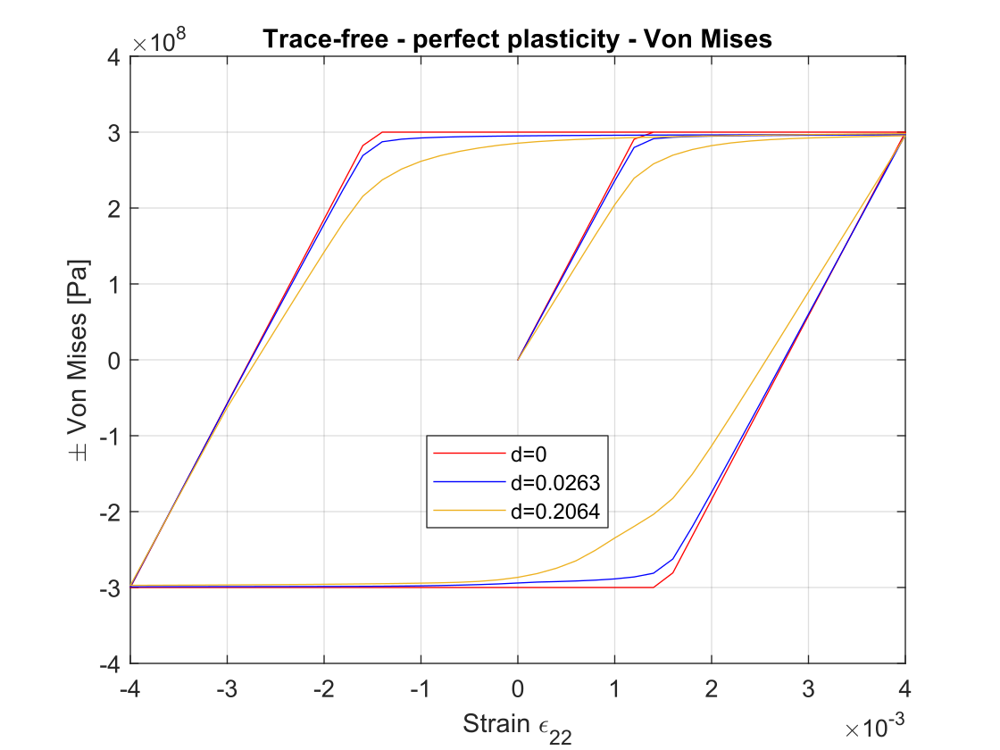
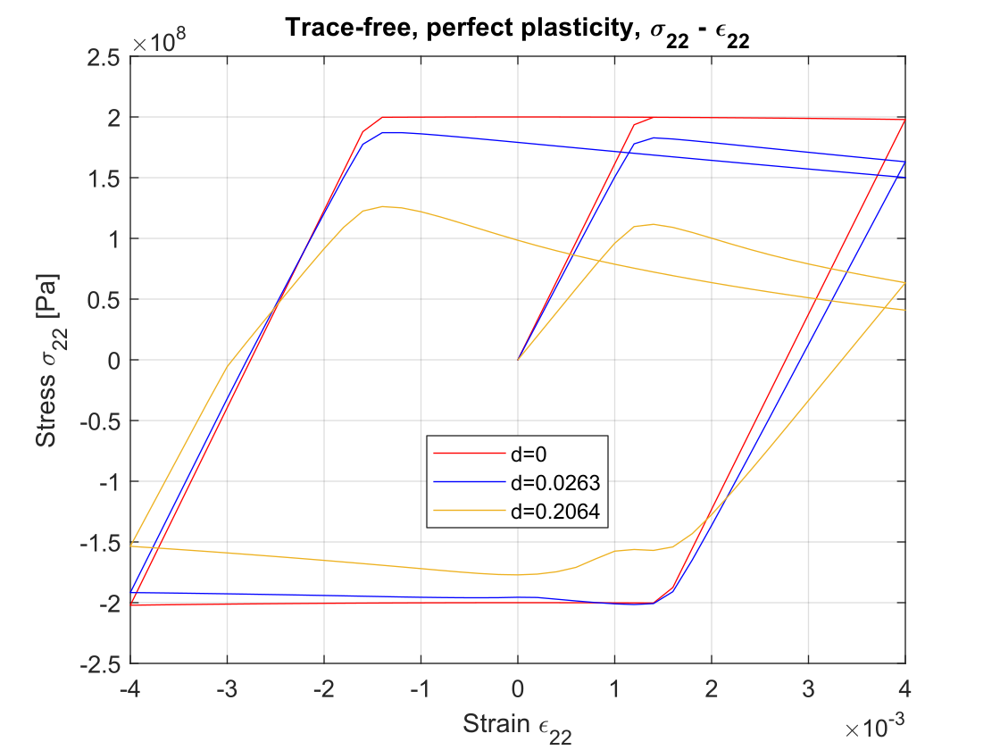
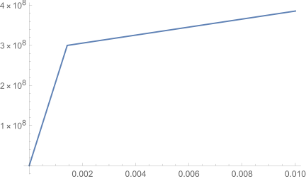

# RVE analysis report

## RVE settings

* Material parameters: $\lambda=E\nu/(1+\nu)(1-2\nu),\mu=E/2(1+\nu)$

  | Young's modulus $E$ | Poisson ratio $\nu$ | $\lambda$    | $\mu$       |
  | ------------------- | ------------------- | ------------ | ----------- |
  | 210 [GPa]           | 0.3                 | 121.15 [GPa] | 80.77 [GPa] |

* Configuration: RVE with square-shaped crack ($a=1$), $r_a\in[0,0.4,0.8]$, corresponding to $d\in[0,0.0263,0.2064].$

  

## Trace-free test

### Trace-free: (a) perfect plasticity

* BC's: $\overline{\varepsilon}=\varepsilon_{11}\mathbf{e}_1\otimes\mathbf{e}_1+\varepsilon_{22}\mathbf{e}_2\otimes\mathbf{e}_2+\varepsilon_{33}\mathbf{e}_3\otimes\mathbf{e}_3,$ where $\varepsilon_{22}=0\rightarrow0.004\rightarrow-0.004\rightarrow0.004,$
$\varepsilon_{11}=\varepsilon_{33}=-{1\over 2}\varepsilon_{22}.$

* Harding behavior
  
  $\sigma_Y=300$ MPa, $\varepsilon_Y=0.001429$

  

* Plots
  
  | Figure                                  | Dir                               |
  | --------------------------------------- | --------------------------------- |
  | $\pm\text{Von Mises} -\varepsilon_{22}$ | `./Plot/trace-free/pp/vm.svg`     |
  | $\sigma_{22}-\varepsilon_{22}$          | `./Plot/trace-free/pp/s22e22.svg` |
  | $\sigma_{11}-\varepsilon_{22}$          | `./Plot/trace-free/pp/s11e22.svg` |
  
  
  
  
  
  

### Trace-free: (b)  isotropic hardening (linear)

* BC's: $\overline{\varepsilon}=\varepsilon_{11}\mathbf{e}_1\otimes\mathbf{e}_1+\varepsilon_{22}\mathbf{e}_2\otimes\mathbf{e}_2+\varepsilon_{33}\mathbf{e}_3\otimes\mathbf{e}_3,$ where $\varepsilon_{22}=0\rightarrow0.004\rightarrow-0.004\rightarrow0.004,$
  $\varepsilon_{11}=\varepsilon_{33}=-{1\over 2}\varepsilon_{22}.$

* Harding behavior

  $\sigma_Y=300$ MPa, $\varepsilon_Y=0.001429$

  

* Plots

  | Figure                                  | Dir                                            |
  | --------------------------------------- | ---------------------------------------------- |
  | $\pm\text{Von Mises} -\varepsilon_{22}$ | `./Plot/trace-free/iso_hard_linear/vm.svg`     |
  | $\sigma_{22}-\varepsilon_{22}$          | `./Plot/trace-free/iso_hard_linear/s22e22.svg` |
  | $\sigma_{11}-\varepsilon_{22}$          | `./Plot/trace-free/iso_hard_linear/s11e22.svg` |